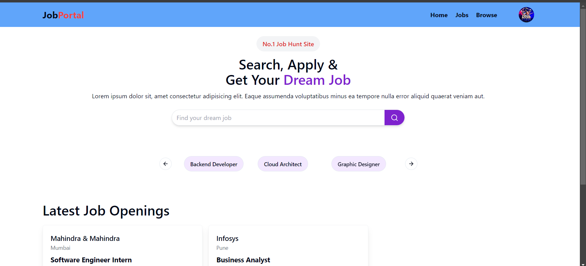

# Job Hunt

**A Job Search platform for students, professionals, and recruiters**



## Project Overview

Job Hunt is a web-based job search portal designed using the **MERN** stack (MongoDB, Express.js, React.js, Node.js). This platform connects students, professionals, and recruiters by providing a streamlined job application process and recruitment workflow.

### Features
- **User Authentication**: Sign up and login functionality for students, professionals, and recruiters with role-based access control.
- **Job Listings**: View available job listings with detailed information.
- **Job Application**: Submit applications directly through the platform.
- **Recruiter Dashboard**: Post job vacancies and manage applicants.

  
## Tech Stack
- **Frontend**: React.js, Redux, Tailwind CSS, Shadecn-ui 
- **Backend**: Node.js, Express.js
- **Database**: MongoDB
- **Authentication**: JWT-based authentication and role-based access control
- **State Management**: Redux with `react-persist` for state persistence

## Installation & Setup

### Prerequisites
- [Node.js](https://nodejs.org/) installed on your machine.
- MongoDB server running locally or an account on [MongoDB Atlas](https://www.mongodb.com/atlas).

### Clone the repository
```bash
git clone https://github.com/your-username/job_hunt.git
cd job_hunt
```
### Backend Setup

1. Navigate to the `backend` directory:
```bash
cd backend 
```
2. Install dependencies:
```bash
npm intsall
```
3. Create a `.env` file in the backend directory and add the following environment variables:
```bash
PORT=5000
MONGO_URI=<your-mongo-db-uri>
JWT_SECRET=<your-jwt-secret>

```
4. Start the backend server::
```bash
npm run dev
```
### Frontend Setup

1. Navigate to the `frontend` directory:
```bash
cd backend 
```
2. Install dependencies:
```bash
npm intsall
```
3. Start the frontend application:
```bash
npm run dev

```

## Usage

- **Users**: Students and professionals can sign up, search for jobs, and apply directly.
- **Recruiters**: Post job listings, manage applications, and contact candidates.
- **Admin**: Manage users, job listings, and handle platform-level operations.

## Future Improvements

- **Advanced Filtering**: Implement more advanced job search filters (e.g., salary range, job type, etc.).
- **Notifications**: Add notification systems for job alerts and application updates.
- **Payment Integration**: For recruiters to pay for premium job postings.

## Contributing

Contributions are welcome! Please feel free to submit a Pull Request.

